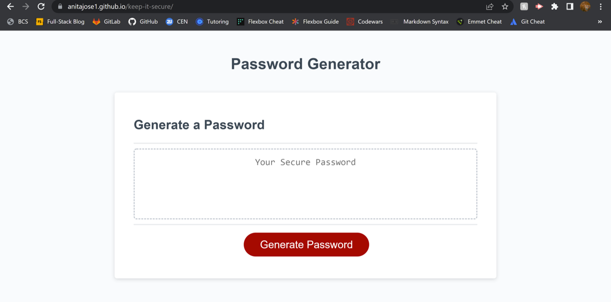

# Keep-It-Secure

## Description

Keep-It-Secure is a password generator that was created for use by an employee of a fictitious company. The employee had access to sensitive data and wanted a strong password that provides greater security.

The requirement was to create an application the employee can use to generate a random password based on length and character criteria they’ve selected.

The app runs in the browser and features dynamically updated HTML and CSS, powered by JavaScript.

The deployed application can be viewed at: https://anitajose1.github.io/keep-it-secure/

## Credits

While updating the JavaScript code, the following sources were useful references:

- https://www.youtube.com/watch?v=BxFi7vVZx4s&t=854s
- https://developer.mozilla.org/en-US/docs/Web/JavaScript/Reference/Global_Objects/Array
- https://www.w3schools.com/jsref/jsref_push.asp

